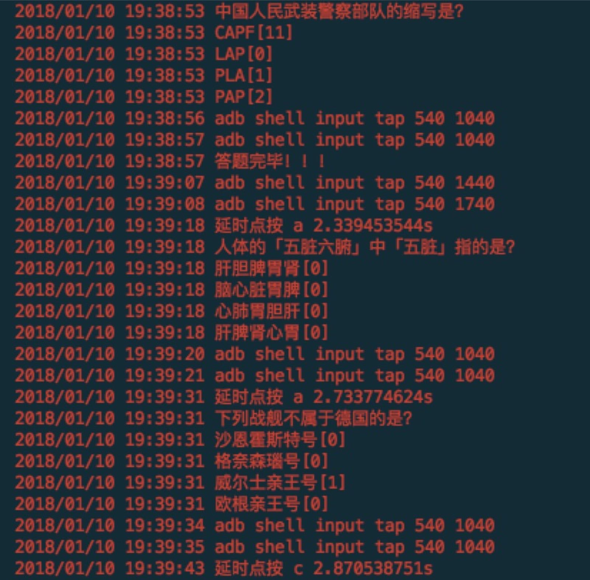

# tounao
微信小游戏头脑王者辅助程序, 欢迎fork

# 快速开始
1. 编译运行(clone 项目至`GOPATH/src`目录下，`go run main.go`),或使用 [release][1]
2. 修改手机的代理设置为PC的IP地址，默认端口为8989
3. 将手机和PC连接至同一网络，用手机浏览器打开地址 ~~~https://github.com~~~  http://\<hostIp> 下载并安装证书
4. ~~手动模式下，选项会被替换，格式如下：以[标答]结尾的选项为题库中已经存在的题目，[数字]结尾的选项，数字为百度结果的权重，仅供参考~~~
5. 手动模式下，因为需要等到百度**结果出来之后才返回数据**，会影响答题速度
6. 建议使用自动模式，数据完全透传，异步获取答案之后调用adb 模拟点击
6. 不同的分辨率需要修改选代码中点击的坐标，因网络情况的不同还可适当调整按钮点击的延时时间，从而提高得分
7. 题库数据越多，可以命中的概率越高,fork本项目你就拥有了1.2w+题库

# 环境依赖
```
echo $GOPATH
git clone git@github.com:wansir/tounao.git $(echo "$GOPATH/src/tounao")
cd  $(echo "$GOPATH/src/tounao")
git submodule init
git submodule update
```

# 功能
1. 分词权重，否定词反选，sqlite3 缓存题库
2. 自动模式：使用ADB 实现Android自动点按，半自动刷分，推荐
3. 手动模式：提示答案权重，自行选择


# 问题
1. goproxy 无法代理 websocket 导致IOS无法使用代理进入游戏，希望各路大神能提供建议

# 想法
在业余时间完成这些小东西的时候，更多的是为了保持一份热情，缓解繁琐业务编码中的一些疲惫

```
2018/01/17 23:28:07 载入sego词典 vendor/github.com/huichen/sego/data/dictionary.txt
2018/01/17 23:28:09 sego词典载入完毕
2018/01/17 23:28:09 database init success
2018/01/17 23:28:09 代理服务端口: 8989
2018/01/17 23:28:09 请将手机连接至同一网络，并设置代理地址为192.168.1.106:8989
2018/01/17 23:28:09 打开http://192.168.1.106 即可安装证书
2018/01/17 23:28:09 当前模式为:manual
```
# 示例



[1]: (https://github.com/wansir/tounao/releases)


